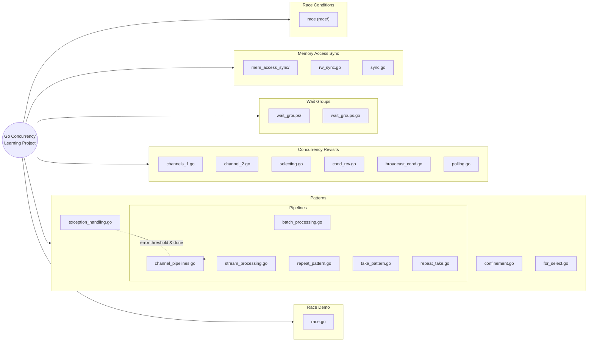

# Go Concurrency Learning Project

A comprehensive exploration of Go's concurrency patterns and mechanisms. This project demonstrates various concurrency concepts through practical examples and experiments.

## 🎯 Project Overview

This repository serves as a hands-on learning resource for understanding Go's concurrency features. Each module focuses on a specific aspect of concurrent programming, with examples that highlight both the power and potential pitfalls of concurrent code.

Currently practicing with reference to the book "Concurrency in Go" by Katherine Cox-Buday (O'Reilly).

## 🗺️ Project Map (Mermaid)

Below is an at-a-glance, clickable map of the repository. On GitHub, many nodes are clickable to jump directly to folders/files.



> Tip: If any links aren’t clickable due to GitHub rendering restrictions, use the Quick Links below.

### Quick Links

- [race/](./race)
- [mem_access_sync/](./mem_access_sync)
- [wait_groups/](./wait_groups)
- [concurrency_revisits/](./concurrency_revisits)
- [patterns/](./patterns)
- [patterns/pipelines/](./patterns/pipelines)

## 📊 Dataflow Diagrams

### Channel Pipeline (generator → add → multiply)

```mermaid
flowchart LR
  classDef stage fill:#eaf7ff,stroke:#66b3ff,stroke-width:1px,color:#003d66
  classDef chan fill:#fff7e6,stroke:#ffb84d,stroke-width:1px,color:#663d00
  classDef out fill:#e8ffea,stroke:#6bd66b,stroke-width:1px,color:#104010
  classDef cancel fill:#ffe6e6,stroke:#ff6666,stroke-width:1px,color:#660000,stroke-dasharray: 3 3

  subgraph P[Channel-based Pipeline]
    direction LR
    A{{generator}}
    B[addStream(+1)]
    C[multipleStream(*2)]
    A -->|int| B -->|int| C --> D[(pipeline out)]
  end

  class A,B,C stage
  class D out

  Done((done)):::cancel
  Done -. cancels .- A
  Done -. cancels .- B
  Done -. cancels .- C

  %% Clickable nodes
  click A "./patterns/pipelines/channel_pipelines.go" "generator() source" _self
  click B "./patterns/pipelines/channel_pipelines.go" "addStream() impl" _self
  click C "./patterns/pipelines/channel_pipelines.go" "multipleStream() impl" _self
```

Quick idea: this pipeline wires `generator → addStream(+1) → multipleStream(*2)` and supports cancellation through a shared `done` channel.

### Repeat / Take Composition

```mermaid
flowchart LR
  classDef stage fill:#eaf7ff,stroke:#66b3ff,stroke-width:1px,color:#003d66
  classDef out fill:#e8ffea,stroke:#6bd66b,stroke-width:1px,color:#104010
  classDef cancel fill:#ffe6e6,stroke:#ff6666,stroke-width:1px,color:#660000,stroke-dasharray: 3 3

  subgraph RT[Repeat → Take]
    direction LR
    R{{repeat(1,2,...)}} --> T[take(N)] --> O[(out)]
  end
  class R,T stage
  class O out

  subgraph RFn[RepeatFn → Take]
    direction LR
    RF{{repeatFn(rand)}} --> T2[take(N)] --> O2[(out)]
  end
  class RF,T2 stage
  class O2 out

  Done2((done)):::cancel
  Done2 -. cancels .- R
  Done2 -. cancels .- T
  Done2 -. cancels .- RF
  Done2 -. cancels .- T2

  %% Clickable nodes
  click R "./patterns/pipelines/repeat_pattern.go" "repeat() impl" _self
  click RF "./patterns/pipelines/repeat_pattern.go" "repeatFn() impl" _self
  click T "./patterns/pipelines/take_pattern.go" "take() impl" _self
  click T2 "./patterns/pipelines/take_pattern.go" "take() impl" _self
```

These building blocks let you generate infinite streams (fixed values or function-produced) and then take a bounded prefix.

## 📁 Project Structure

```
learn-concurrency/
├── main.go                      # Entry point and experiment runner
├── concurrency_revisits/        # Deeper dives and additional concurrency topics
│   ├── broadcast_cond.go        # Broadcasting with sync.Cond
│   ├── channel_2.go             # Simple channel stream example
│   ├── channels_1.go            # Channel basics, closing semantics, token distribution
│   ├── cond_rev.go              # Condition variables (sync.Cond) with queue backpressure
│   ├── polling.go               # sync.Pool basics and pooled file reading
│   ├── race_condition.go        # Race vs data race examples with mutex
│   └── selecting.go             # select statement behavior and fairness
├── mem_access_sync/             # Memory synchronization examples
│   ├── rw_sync.go               # RWMutex for concurrent reads and exclusive writes
│   └── sync.go                  # Mutex, cache with RWMutex, contention demos
├── wait_groups/                 # WaitGroup coordination examples
│   └── wait_groups.go
├── race/                        # Race condition demonstrations
│   └── race.go
├── patterns/                    # Concurrency patterns and idioms
│   ├── confinement.go           # Ad hoc vs lexical confinement
│   ├── for_select.go            # for-select loops, default cases, signaling with done
│   ├── exception_handling.go    # Error handling strategy around goroutines
│   └── pipelines/               # Pipeline-oriented patterns
│       ├── batch_processing.go  # Batch transform pipeline (adds then multiplies)
│       ├── stream_processing.go # Stream processing (per-element transform)
│       ├── channel_pipelines.go # Channel-based pipeline stages (generator/add/multiply)
│       ├── repeat_pattern.go    # repeat, repeatFn patterns
│       ├── take_pattern.go      # take pattern
│       └── repeat_take.go       # Combining repeat + take
└── README.md                    # This file
```

## 🚀 Current Features

### 1. Race Conditions (`race/`)

-   **Purpose**: Demonstrates how race conditions occur in concurrent programs
-   **Key Concepts**:
    -   Shared memory access without synchronization
    -   Non-deterministic behavior in concurrent execution
    -   Data races and their unpredictable outcomes

**What it does:**

-   Runs the same function 2000 times to show different results
-   Tracks unique values generated due to race conditions
-   Illustrates why synchronization is crucial

### 2. Memory Access Synchronization (`mem_access_sync/`)

-   **Purpose**: Shows how to properly synchronize access to shared memory
-   **Key Concepts**:
    -   Mutex locks for thread-safe operations
    -   RWMutex for allowing concurrent readers with exclusive writers
    -   WaitGroups for goroutine coordination
    -   Atomic vs non-atomic operations (why `x++` is not atomic)

**What it does:**

-   Demonstrates safe concurrent counter incrementation
-   Uses `sync.Mutex` to prevent race conditions
-   Shows the difference between synchronized and unsynchronized access
 -   Implements a simple concurrent-safe cache with `sync.RWMutex`
 -   Demonstrates reader/writer patterns and contention

### 3. Wait Groups (`wait_groups/`)

-   **Purpose**: Coordinate goroutines and block until they finish
-   **Key Concepts**:
    -   `sync.WaitGroup`
    -   Correctly adding and marking goroutine completion

**What it does:**

-   Compares execution with and without `WaitGroup` to highlight premature exit vs proper synchronization

### 4. Condition Variables and Broadcasting (`concurrency_revisits/cond_rev.go`, `broadcast_cond.go`)

-   **Purpose**: Demonstrate backpressure and event signaling using `sync.Cond`
-   **Key Concepts**:
    -   Waiting and signaling with `Cond.Wait`, `Cond.Signal`, and `Cond.Broadcast`
    -   Protecting shared state with the `Cond`'s mutex

**What it does:**

-   Bounded queue example that blocks producers when the queue is full and resumes when space is available
-   Broadcasts a single event to wake multiple waiting goroutines (email/SMS/WhatsApp example)

### 5. Channels: Basics, Closing Semantics, and Token Distribution (`concurrency_revisits/channels_1.go`, `channel_2.go`)

-   **Purpose**: Practice Go channel fundamentals and patterns
-   **Key Concepts**:
    -   Sending/receiving on channels
    -   Closing channels and observing zero-value behavior on receive
    -   Using channels as a limited resource semaphore/token bucket

**What it does:**

-   Minimal send/receive example
-   Demonstrates that reads from a closed channel yield the element type's zero value
-   Distributes a fixed number of “scholarship” tokens to many goroutines via a channel

### 6. Select Statement and Fairness (`concurrency_revisits/selecting.go`)

-   **Purpose**: Show non-deterministic selection among multiple ready channel operations
-   **Key Concepts**:
    -   `select` over multiple channels
    -   Fairness/randomization when multiple cases are ready

**What it does:**

-   Competes receives between two channels streaming values
-   Demonstrates that when multiple cases are ready (e.g., both channels closed/ready), `select` picks a case at pseudo-random, roughly balanced over many iterations

### 7. Pooling and Efficient Allocations (`concurrency_revisits/polling.go`)

-   **Purpose**: Reduce allocations and reuse memory with `sync.Pool`
-   **Key Concepts**:
    -   `sync.Pool` lifecycle: Get, Put, New
    -   Temporary object pooling for high-throughput scenarios

**What it does:**

-   Basic pool demonstration creating and reusing instances
-   File reading using a pool of 1KB buffers to minimize allocations while streaming a file

### 8. Concurrency Patterns: Confinement and For-Select (`patterns/`)

-   **Purpose**: Demonstrate safe ownership and non-blocking loop patterns
-   **Key Concepts**:
    -   Ad hoc confinement by convention vs lexical confinement by type/ownership
    -   Returning read-only channels to enforce confinement
    -   `for { select { default: ... } }` loops and the role of `default`
    -   Using a `done` channel to signal completion and exit loops

**What it does:**

-   Streams numbers from a goroutine using both ad hoc and lexically confined channels
-   Shows a spinning for-select with `default`, and a channel-triggered exit with `done`

### 9. Pipeline Patterns (`patterns/pipelines/`)

-   **Purpose**: Explore different ways to process data through stages: batch, streaming, and channel-based pipelines, plus foundational generator utilities.
-   **Key Concepts**:
    -   Batch vs stream trade-offs (memory footprint vs call overhead)
    -   Channel-backed stages with cancellation via a `done` channel
    -   Reusable patterns: `repeat`, `repeatFn`, and `take`

**What it does:**

-   `DisplayBatchProcessing()`: Applies transformations to an entire slice at once
-   `DisplayStreamProcessing()`: Transforms one element at a time
-   `DisplayChannelPipeline()`: Wires generator → add → multiply stages over channels
-   `DisplayRepeatPattern()`: Repeats a fixed sequence until cancellation
-   `DisplayRepeatFnPattern()`: Repeats values from a generator function (e.g., crypto/rand)
-   `DisplayTakePattern()`: Takes the first N values from a stream
-   `DisplayRepeatTake()`: Combines `repeat` and `take` to get N repeated values

### 10. Exception Handling Around Goroutines (`patterns/exception_handling.go`)

-   **Purpose**: Centralize error handling where you have the most context (caller/main), not inside the goroutine itself.
-   **Key Concepts**:
    -   Return errors from worker functions instead of panicking in goroutines
    -   Enforce error thresholds and cancellation using a `done` channel

**What it does:**

-   `DisplayExceptionHandling()`: Iterates over URLs, collects results, counts errors, and stops early once an error threshold is reached.

## 🏃‍♂️ Running the Examples

```bash
# Clone the repository
git clone <repository-url>
cd learn-concurrency

# Run specific examples by uncommenting them in main.go
go run main.go
```

### Available Examples (uncomment in `main.go`):

```go
// Race conditions
race.DisplayRace()

// Memory synchronization
mem_sync.DisplayMemorySync()
mem_sync.DisplaySafeCounter()
mem_sync.DisplayCacheSync()

// WaitGroups
waitgroups.DisplayWaitGroup()

// Condition variables and broadcasting
concurrencyrevisits.DisplayConditionVariable()
concurrencyrevisits.DisplayBroadcastingCondition()

// Channels
concurrencyrevisits.DisplaySimpleChannel()
concurrencyrevisits.DisplayChannelWithClose()
concurrencyrevisits.ScholarshipDistribution()
concurrencyrevisits.DisplayMultiSenderChannelStream()

// Select statement
concurrencyrevisits.DisplaySelecting()
concurrencyrevisits.DisplaySelectingSimultaneously()

// sync.Pool
concurrencyrevisits.DisplayPoolingConcept()
concurrencyrevisits.PoolReadmeFile("./README.md")

// Concurrency patterns
patterns.DisplayAdHocConfinement()
patterns.DisplayLexicalConfinement()
patterns.DisplayForSelect()
patterns.DisplayForSelectWithChannel()

// Exception handling pattern
patterns.DisplayExceptionHandling()

// Pipeline patterns
pipelines.DisplayBatchProcessing()
pipelines.DisplayStreamProcessing()
pipelines.DisplayChannelPipeline()
pipelines.DisplayRepeatPattern()
pipelines.DisplayRepeatFnPattern()
pipelines.DisplayTakePattern()
pipelines.DisplayRepeatTake()
```

## 📚 Learning Outcomes

After exploring this project, you'll understand:

-   ✅ How race conditions occur and why they're problematic
-   ✅ The importance of synchronization in concurrent programs
-   ✅ How to use mutexes to protect shared resources
-   ✅ WaitGroups for coordinating multiple goroutines
-   ✅ The difference between atomic and non-atomic operations
-   ✅ How and when to use RWMutex vs Mutex
-   ✅ Channel fundamentals and closing semantics
-   ✅ Using `select` to multiplex channel operations and its fairness behavior
-   ✅ Using `sync.Cond` for signaling/backpressure and broadcasting events
-   ✅ Reducing allocations with `sync.Pool` and pooled buffers for I/O
-   ✅ Confinement patterns: when to use ad hoc vs lexical confinement (read-only channels)
-   ✅ For-select patterns: using `default` for non-blocking loops and signaling completion with a `done` channel

## 🔮 Planned Additions

This project will be incrementally updated with more concurrency patterns:

-   [ ] **Context Package**: Cancellation and timeouts
-   [ ] **Worker Pools**: Managing concurrent task execution
-   [ ] **Atomic Operations**: Lock-free programming
-   [x] **Pipeline Patterns**: Data processing pipelines
-   [ ] **Fan-in/Fan-out**: Distributing and collecting work
-   [ ] **Rate Limiting**: Controlling execution frequency
-   [ ] **Deadlock Prevention**: Avoiding common pitfalls

## 🛠️ Prerequisites

-   Go 1.21+ (uses `for range` syntax)
-   Basic understanding of Go syntax
-   Familiarity with goroutines concept

## 📖 Resources

-   [Go Concurrency Patterns](https://go.dev/blog/pipelines)
-   [Effective Go - Concurrency](https://go.dev/doc/effective_go#concurrency)
-   [The Go Memory Model](https://go.dev/ref/mem)
-   Concurrency in Go by Katherine Cox-Buday (O'Reilly)

## 🤝 Contributing

Feel free to add more concurrency examples or improve existing ones. Each new pattern should:

1. Have its own package/directory
2. Include clear documentation
3. Demonstrate both correct and incorrect usage where applicable
4. Update this README with the new feature

---

_Happy learning! 🎉_
